# Актуальная ER-модель

Источник истины — [`backend/migrations/000001_init.up.sql`](../backend/migrations/000001_init.up.sql).
Диаграмма ниже отражает текущую схему, включая `share_recaps`.

Файл [`ER-model.drawio.png`](./ER-model.drawio.png) сохранён как ранний концептуальный
вариант. Он не содержит `share_recaps` и части актуальных полей, поэтому для проверки схемы
следует использовать этот документ и SQL-миграцию.

```mermaid
erDiagram
    users {
        bigint id PK
        varchar username
        varchar image_url
        timestamptz created_at
        timestamptz updated_at
    }

    user_stats {
        bigint user_id PK, FK
        bigint buys_count
        bigint sells_count
        bigint favorites_count
        bigint conversations_count
        numeric spent_amount
        bigint rating_sum
        bigint reviews_count
        bigint max_streak_days
        bigint max_inactive_gap_days
        timestamptz updated_at
        timestamptz processed_at
    }

    achievements {
        bigint id PK
        varchar code UK
        varchar name
        varchar description
        varchar image_url
    }

    achievement_rules {
        bigint achievement_id PK, FK
        jsonb rule
        timestamptz created_at
        timestamptz updated_at
    }

    user_achievements {
        bigint user_id PK, FK
        bigint achievement_id PK, FK
        timestamptz created_at
    }

    yearly_recaps {
        bigint id PK
        bigint user_id FK
        int year
        timestamptz created_at
        jsonb payload
    }

    share_recaps {
        bigint id PK
        text token UK
        bigint user_id FK
        int year
        bigint recap_id FK
        jsonb payload
        timestamptz created_at
    }

    categories {
        bigint id PK
        varchar name
        bigint parent_id FK
    }

    listings {
        bigint id PK
        bigint seller_id FK
        bigint category_id FK
        varchar image_url
        varchar name
        varchar city
        varchar status
        timestamptz created_at
        timestamptz updated_at
        numeric price
    }

    favorite_listings {
        bigint listing_id PK, FK
        bigint user_id PK, FK
        timestamptz created_at
    }

    user_sessions {
        bigint id PK
        bigint user_id FK
        timestamptz started_at
        timestamptz ended_at
    }

    deals {
        bigint id PK
        bigint buyer_id FK
        bigint listing_id FK
        varchar status
        timestamptz created_at
        timestamptz updated_at
        numeric price
        timestamptz completed_at
    }

    reviews {
        bigint id PK
        bigint reviewer_id FK
        bigint reviewee_id FK
        bigint deal_id FK
        varchar text
        int rating
        timestamptz created_at
    }

    user_searches {
        bigint id PK
        bigint user_id FK
        bigint category_id FK
        varchar query
        numeric min_price
        numeric max_price
        timestamptz created_at
    }

    listing_views {
        bigint id PK
        bigint user_id FK
        bigint listing_id FK
        timestamptz created_at
    }

    conversations {
        bigint id PK
        bigint initiator_id FK
        bigint listing_id FK
        timestamptz created_at
    }

    conversation_participants {
        bigint user_id PK, FK
        bigint conversation_id PK, FK
    }

    users ||--|| user_stats : has
    achievements ||--o| achievement_rules : governed_by
    users ||--o{ user_achievements : earns
    achievements ||--o{ user_achievements : awarded_as
    users ||--o{ yearly_recaps : owns
    users ||--o{ share_recaps : creates
    yearly_recaps ||--o{ share_recaps : snapshotted_as
    categories o|--o{ categories : parent_of
    users ||--o{ listings : sells
    categories ||--o{ listings : classifies
    users ||--o{ favorite_listings : saves
    listings ||--o{ favorite_listings : saved_as
    users ||--o{ user_sessions : starts
    users ||--o{ deals : buys
    listings ||--o{ deals : involved_in
    users ||--o{ reviews : writes
    users ||--o{ reviews : receives
    deals ||--o{ reviews : reviewed_in
    users ||--o{ user_searches : performs
    categories ||--o{ user_searches : limits
    users ||--o{ listing_views : views
    listings ||--o{ listing_views : viewed_as
    users ||--o{ conversations : initiates
    listings ||--o{ conversations : discussed_in
    users ||--o{ conversation_participants : participates
    conversations ||--o{ conversation_participants : contains
```

## Важные ограничения

- `(yearly_recaps.user_id, yearly_recaps.year)` уникальна;
- `share_recaps.token` уникален;
- `(user_achievements.user_id, achievement_id)` — составной первичный ключ;
- `(favorite_listings.user_id, listing_id)` — составной первичный ключ;
- `(conversation_participants.user_id, conversation_id)` — составной первичный ключ;
- завершённая сделка для одного объявления может быть только одна;
- статусы объявления: `active`, `sold`, `cancelled`;
- статусы сделки: `pending`, `completed`, `cancelled`;
- рейтинг отзыва — целое число от 1 до 5.

Docker Compose применяет init-миграции только при создании пустого PostgreSQL-volume.
Изменение `000001_init.up.sql` не обновляет уже существующую базу автоматически.
